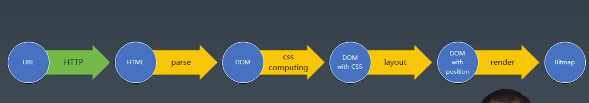
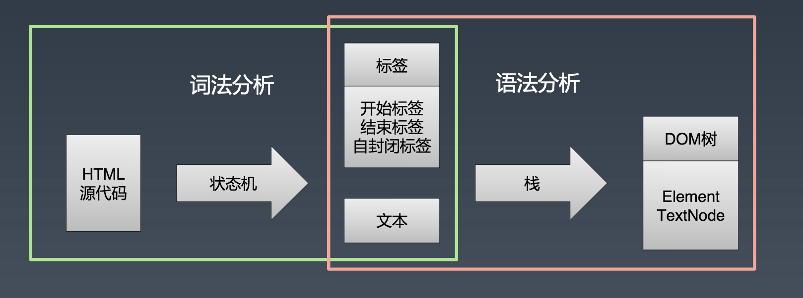
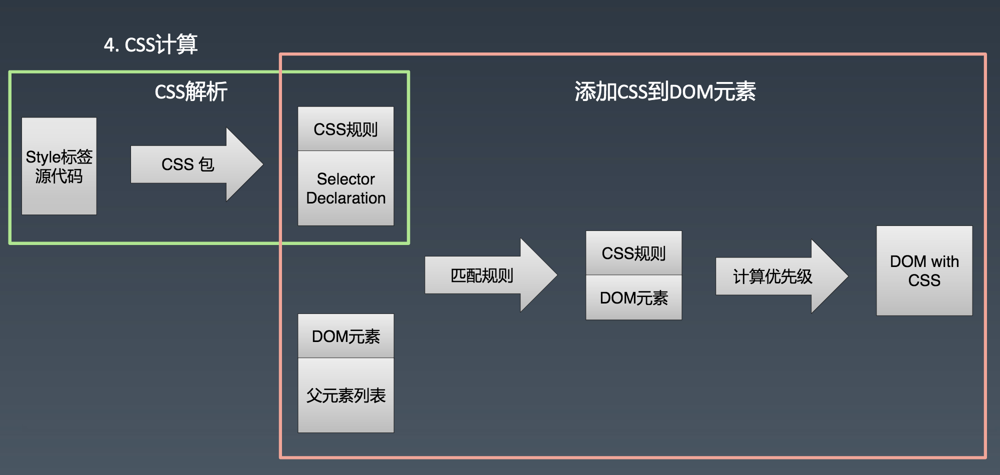

# toy-browser学习总结

## 浏览器渲染流水线



我们通过浏览器浏览网页的过程基本是通过一个url到具体页面的过程，具体一点是通过url到一张图片的过程。

疑问：图片？
计算机最终展示在我们面前的一定是一张图片，这个图片在计算机的专业术语中叫Bitmap，Bitmap才能传递给显卡驱动设备最终转变成光信号。

浏览器的工作过程就是url到Bitmap的过程

具体过程为url请求通过http协议获取到html；html通过parse转变成DOM树；DOM树上的元素关联了css规则，这些规则经过css computing决定那些规则是覆盖，那些是替换，这一步的结果为DOM with css；再经过layout排版布局决定DOM具体的位置，这一步结果为DOM with position；最终通过render渲染成Bitmap，借助硬件和操作系统变成我们看到的画面。

## 状态机
状态机的规范的概念比较泛，比较抽象，可以用自己的理解具象一下


### 每一个状态机都是一个机器

1. 每一个状态机都可以输入、存储、输出
2. 所有的状态机接受的输入是一致的
3. 用函数的表示的话，对应的是纯函数

### 状态机知道下一个状态
* 每一个状态机都有确定的下一个状态（Moore型）
* 根据输入决定下一个状态（Mealy型）

### 使用函数表示状态机的一个通用模式

```javascript
// 每个函数是一个状态
function state(input){ // 函数参数就是输入
  // 在函数中可以自由的编写代码，处理每个状态的逻辑
  return netx;
}
// 调用
while(input){
  // 把状态机的返回值作为下一个状态
  state = state(input);
}
```


## 网络

#### 网络七层模型
#### 网络协议： HTTP/TCP/IP

#### HTTP协议

##### Request
  * line
    - Mathod
    - Path
    - Protocol version
  * header
  * body

##### Response
  * Status line
    - Protocol version
    - Status code
    - Status text
  * header
  * body

---

## HTML解析



## css计算




## layout

* 以flex布局为例
* 确定元素的主轴（main）和交叉轴（cross）
* 对元素进行分行
* 对每行的元素进行位置计算，确定每个元素的width/height/top/bottom/left/right

## render

依赖图形环境，使用images包，从DOM根元素递归绘制每个子元素。
